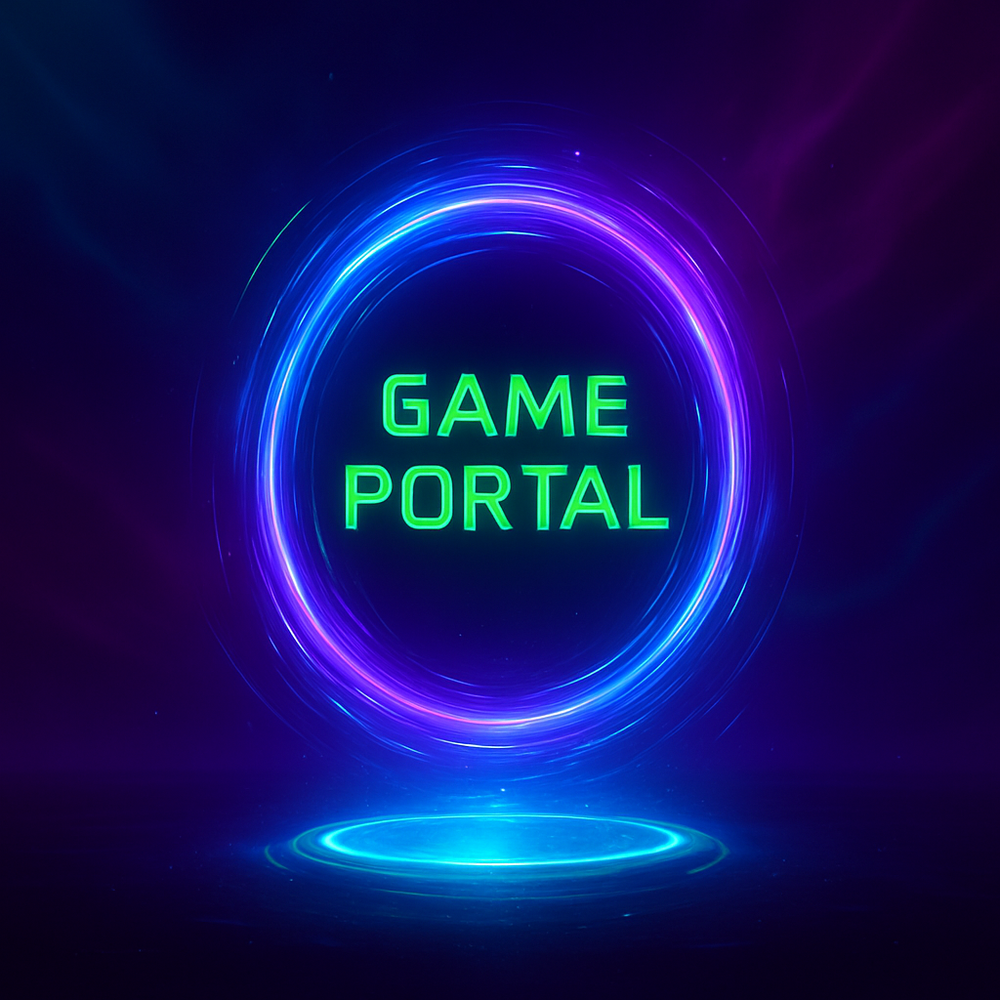

# 🎮 Game Portal — NTCC Project  
_A collaborative project by **Pratham Ranjan** & **Chirag Agarwaal**_

  

Welcome to the **Game Portal**, an interactive web application developed as part of our NTCC project. It features two exciting browser-based games:

- 🧠 **Mind Maze** — A dynamic, AI-assisted pathfinding puzzle  
- ❌⭕ **Ultimate Tic Tac Toe** — A strategic twist on the classic game, with AI opponent

Built using **Python (Flask)**, **HTML/CSS/JS**, and AI logic, this portal showcases engaging gameplay, modern UI, and scalable backend design.

---

## 🚀 Features

- 🔥 Interactive homepage with animated visuals  
- 🎵 Background music and click sound effects  
- 🧠 Dynamic maze generation with real-time pathfinding  
- 🤖 MCTS AI for Tic Tac Toe  
- 🎮 Local scoreboards per session  
- ⚙️ Settings panel for sound and theme control  
- 🌙 Dark-themed responsive layout  

---

## 🛠️ Tech Stack

- **Backend**: Python, Flask  
- **Frontend**: HTML5, CSS3, JavaScript (vanilla)  
- **Game Logic**: MCTS AI, DFS Pathfinding  
- **Other Tools**: JSON for score tracking, session management via Flask  

---

## 📂 Project Structure

├── app.py
├── game_logic.py
├── maze_generator.py
├── mcts_ai.py
├── scoreboard.json
├── README.md
├── static/
│ ├── images/
│ │ └── portal-thumbnail.jpg
│ ├── sounds/
│ ├── script.js
│ ├── script(m).js
│ ├── style.css
│ ├── style(m).css
│ └── styled.css
├── templates/
│ ├── base.html
│ ├── home.html
│ ├── mind_maze.html
│ └── ultimate_ttt.html
└── pycache/

---

## 🌐 Live Demo

🔗 [View Live Portal](https://gameportal.pythonanywhere.com/)

---

## 🧪 How to Run Locally

1. **Clone the repository**
   git clone https://github.com/prathamranjan05/game-portal.git
   cd game-portal

2. **Create a virtual environment**

   python -m venv venv
   venv\Scripts\activate  # On Windows

3. **Install dependencies**

   pip install flask

4. **Run the app**

   python app.py

👨‍💻 Developers
Pratham Ranjan — https://github.com/prathamranjan05

📜 License
This project is open-source and free to use for educational purposes.
